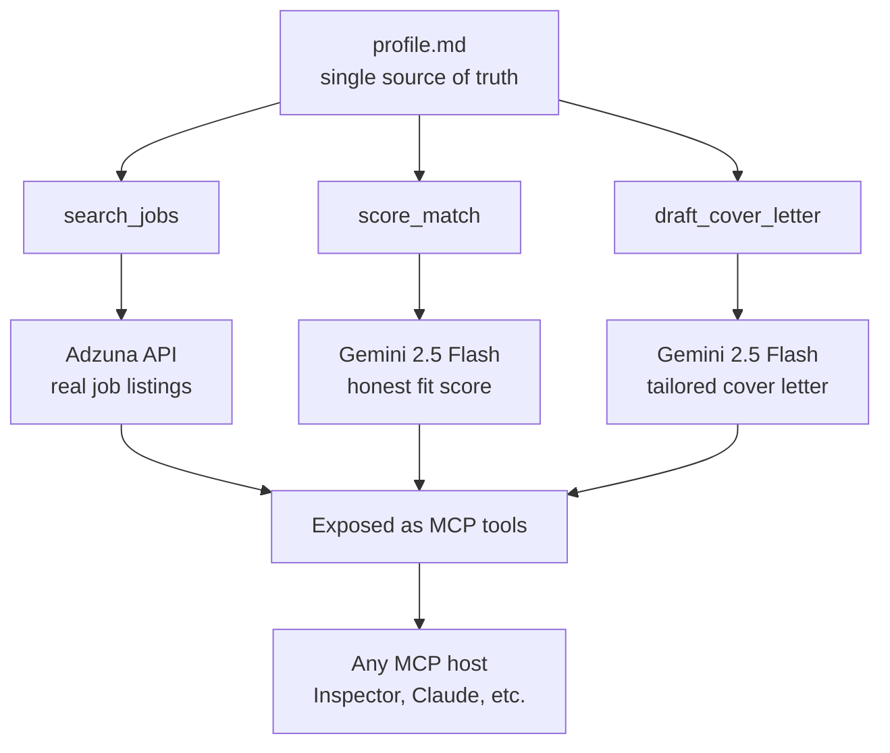

# Job Assistant — an MCP Server for Smarter Job Hunting 

Hey, welcome. This is a project I built to learn the **Model Context Protocol (MCP)** by solving a problem I actually have: job hunting is slow, repetitive, and most of the effort goes into roles I was never a strong fit for in the first place.

So instead of automating my way to hundreds of blind applications (which doesn't work, and breaks every job board's rules anyway), I built a tool that does the *tedious* part finding roles, honestly scoring my fit, and drafting a tailored first draft and leaves the *deciding* part to me.

If you're reading this, you're probably one of three people: someone checking out my work, a fellow learner trying to understand MCP, or future-me coming back after a break. This README is written for all three.

<br>

## The one-line version

It searches real job listings, scores how well each one actually fits my profile, and drafts a tailored cover letter all exposed as tools over the Model Context Protocol, so any AI host can use them.

> **The guiding principle: the AI drafts, I decide. It never applies to anything for me.**

<br>

## Why I built it this way

A quick bit of honesty, because the *why* matters more than the code.

Everyone's talking about auto-applying to jobs with AI. I looked into it and decided against it, for two reasons:

- **It doesn't actually work.** Mass-applied applications get filtered out before a human ever sees them.
- **It breaks the rules.** Bulk automation violates the terms of service of every major job platform exactly the wrong signal to send when the roles I want are at places that care deeply about rules and governance.

So the goal here isn't volume. It's **quality, speed, and honesty**: fewer applications, each one a genuine fit, each one tailored, produced in a fraction of the usual time with me reviewing and submitting every single one myself.

<br>

## What it does

The tool is built around a single source of truth a `profile.md` file describing my real background. Every feature reads from it, and nothing is allowed to invent experience I don't have. (That grounding idea comes straight from a retrieval-augmented-generation project I built earlier.)

On top of that profile sit three tools, which form a funnel:

**🔍 `search_jobs`: casts the net.**
Calls the Adzuna job-search API and returns real listings by role and location, with titles, companies, salaries, descriptions, and apply links.

**📊 `score_match`: narrows it down.**
Sends a listing plus my profile to an LLM and returns an honest fit score out of 100, the requirements I clearly meet (with evidence from my profile), the gaps, and a recommendation like "strong apply" or "stretch." This is the step that turns a long list into a short one.

**✍️ `draft_cover_letter`: does the slow work.**
Writes a tailored, ATS-friendly cover letter for the roles worth applying to, drawing only on my real experience.

So the flow is simple:

> **cast wide → score down to a shortlist → draft for the best → review and send myself**

<br>

## How it fits together



Everything runs locally except the two API calls Adzuna for jobs, Gemini for the AI work. My personal profile never leaves my machine.

<br>

## What is MCP, quickly?

If you haven't come across it: **MCP (Model Context Protocol)** is an emerging open standard for how AI tools talk to each other. Think of it as a universal adapter instead of hardcoding logic into one app, you expose clean **tools** and **resources** over a protocol that any AI host can discover and call.

In this project:

- the three functions above are **tools** (actions a host can run), and
- the profile is a **resource** (data a host can read).

That separation is the core MCP idea.

<br>

## The tech stack

| Layer | Tool | Role |
| --- | --- | --- |
| Protocol | MCP Python SDK (FastMCP) | exposes tools and resources |
| Job data | Adzuna API | real, official, free job listings |
| AI reasoning | Gemini 2.5 Flash on Vertex AI | scoring and drafting |
| Language | Python 3.12 | everything |
| Environment | Docker + Dev Containers | portable, reproducible setup |
| Config | python-dotenv | loads API keys from `.env` |

This project reuses the Vertex AI / Gemini setup from my previous Google ADK project each project building on the last.

<br>

## Getting it running

### What you'll need first

- Docker Desktop and VS Code (with the Dev Containers extension)
- A free Adzuna API account — [developer.adzuna.com](https://developer.adzuna.com)
- A Google Cloud project with Vertex AI enabled

### Step 1 — Open in the dev container

```bash
git clone https://github.com/AfiaRishta/MCP-SDK-2026.git
cd MCP-SDK-2026
code .
```

When VS Code asks **"Reopen in Container?"**, click it. The container builds and installs everything automatically. Wait for the green **Dev Container** badge in the bottom-left corner.

### Step 2 — Add your API keys

Create a `.env` file inside the `job_assistant_mcp` folder:

```
ADZUNA_APP_ID=your_adzuna_app_id
ADZUNA_APP_KEY=your_adzuna_app_key
```

### Step 3 — Authenticate with Google Cloud

```bash
gcloud auth application-default login
```

Follow the browser link, sign in, and paste the code back.

### Step 4 — Fill in your profile

Open `job_assistant_mcp/profile.md` and write in your real background — summary, education, experience, skills, and what you're looking for. The quality of the scoring and cover letters depends entirely on this file.

### Step 5 — Run it

```bash
cd job_assistant_mcp
mcp dev server.py
```

This launches the MCP Inspector a browser-based tool for testing. Open the local URL it prints (check the **Ports** tab in VS Code if it doesn't open automatically).

<br>

## Using it

In the Inspector:

1. **Resources tab** → open `profile://me` to confirm your profile loads.
2. **Tools tab** → run `search_jobs` with a role and location, then copy a listing's title and description.
3. Run `score_match` with that title and description get an honest fit score with evidence and gaps.
4. Run `draft_cover_letter` for the roles worth it get a tailored draft.
5. Review the draft, make it sound like you, and apply yourself through the real link.

A typical session: search your target roles, score the handful that look promising, draft letters for the 3-5 genuine fits, and submit them yourself. What used to take a whole evening for one good application now produces several.

<br>

## Project structure

```text
MCP-SDK-2026/
├── .devcontainer/
│   └── devcontainer.json      ← container setup (Python, Node, GitHub CLI)
├── job_assistant_mcp/
│   ├── server.py              ← the MCP server and its three tools
│   ├── profile.md             ← your background (the source of truth)
│   └── .env                   ← your API keys (never committed)
├── requirements.txt           ← pinned dependencies
└── .gitignore                 ← keeps secrets and junk out of git
```

<br>

## Honest limitations

Worth being straight about, because knowing the edges matters:

- **No Indeed, SEEK, or LinkedIn.** They don't offer open APIs and scraping breaks their terms. Adzuna is the one genuinely open, official source and building on sanctioned data is a deliberate choice, not a shortcut.
- **It drafts cover letters, not resumes yet.** A resume-tailoring tool is the natural next addition.
- **It never applies for you.** By design. It gets each application to "ready to send," and I click submit. That keeps it within every platform's rules.
- **The scoring is only as good as the profile.** Honest in, honest out.

<br>

## What's next

- A `tailor_resume` tool that suggests which experiences to emphasise and which keywords to mirror for a given listing.
- A governance layer: an application tracker, an audit log of every job scored and drafted, and a formal approval step before anything is marked as submitted.
- Connecting the server to a full AI host (like Claude Desktop) so the whole thing runs through natural conversation.

<br>

## What I learned

This project taught me things I couldn't have picked up from reading alone:

- How MCP actually works from the inside tools, resources, and the protocol that connects them
- How to ground an LLM in a real source so it can't invent things (my RAG principle, applied to my own CV)
- Why honest, official API integration beats scraping technically and professionally
- Why mass-applying to jobs fails, and why a quality funnel beats volume every time
- How each project builds on the last: ADK agents → RAG → MCP, one layer at a time

<br>

## Built by

**Afia** — Bachelor of IT, Software Engineering (La Trobe University Bendigo, 2026)

Transitioning into AI engineering, learning out loud, one project at a time.

---

*If something doesn't work, 90% of the time it's either the dev container not being active or a missing key in your `.env`. Check those two first.*
